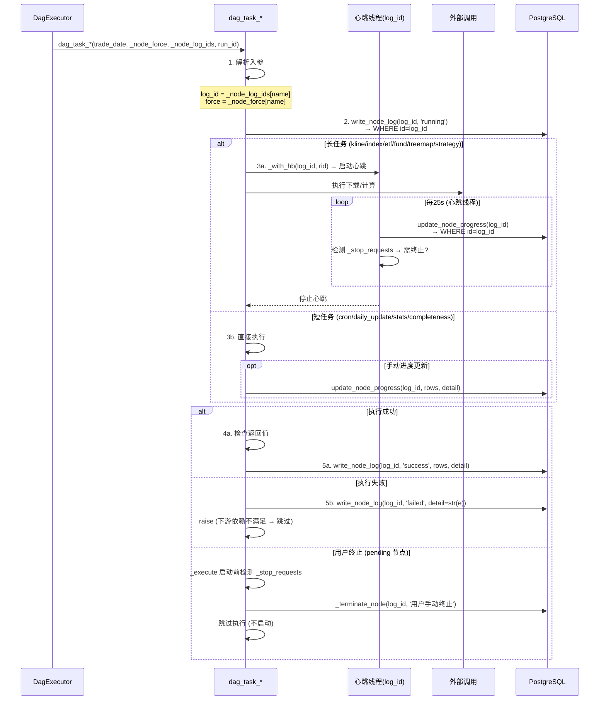
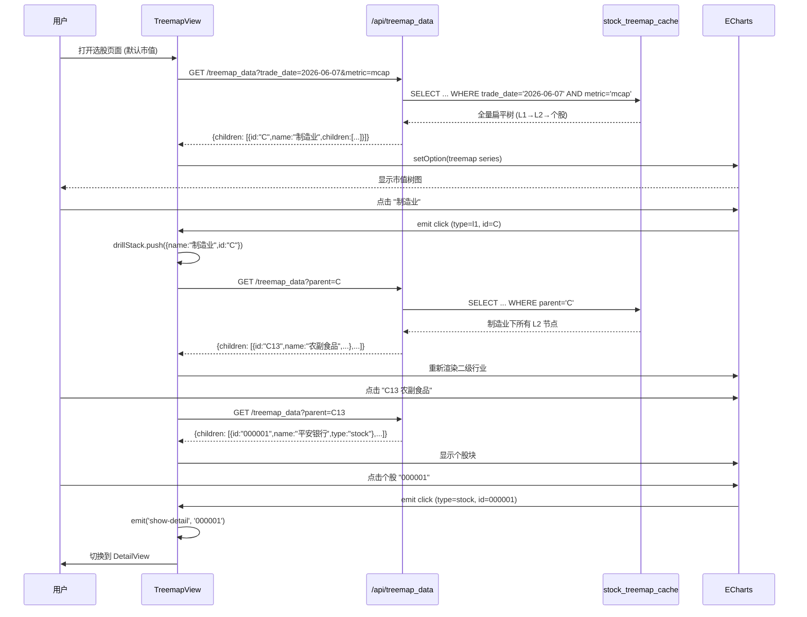
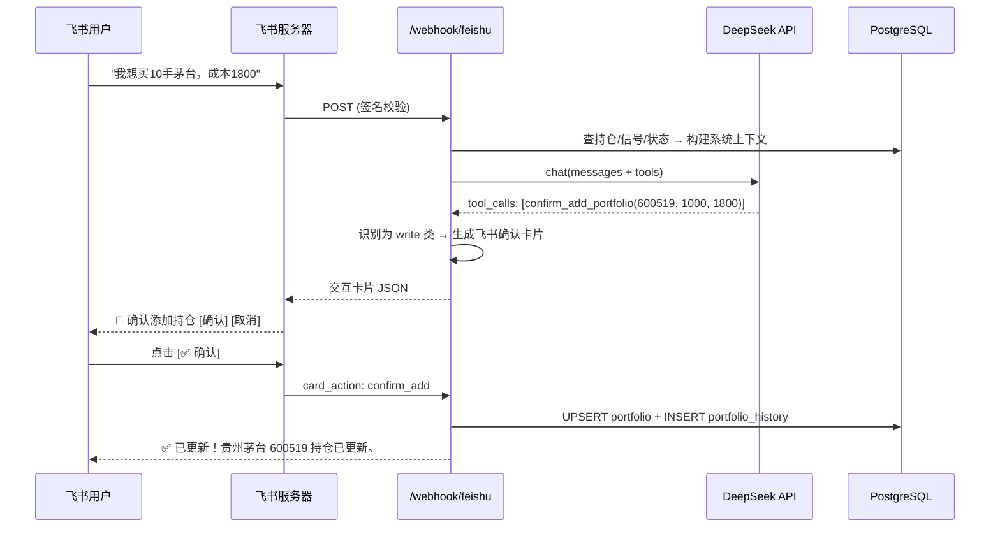

# 个股买卖点监测系统 (K道) — 架构设计文档

> **版本**: v2.2  
> **最后更新**: 2026-07-07  
> **生产地址**: https://s.pmlab.top

---

## 1. 项目简介

**K道** 是一个全栈 A 股量化监测系统，核心能力：

| 能力 | 描述 |
|------|------|
| 数据采集 | 每日自动从 baostock 拉取 A 股 / 指数 / ETF 日 K 线 + 基本面数据 |
| 策略引擎 | 3 策略并行计算（布林线 / 量价背离 / 周趋势），投票融合买卖信号 |
| 可视化 | ECharts 市值树图（行业 drill-down）、持仓盈亏、K 线 + 技术指标 |
| 飞书机器人 | DeepSeek AI 驱动的飞书 Bot，自然语言查行情/管持仓/调策略 |
| DAG 流水线 | 有向无环图调度器，自动编排数据采集 → 基本面 → 树图 → 策略 → 统计 |
| 实时推送 | WebSocket 服务器推送模块，支持 DAG 状态/日志/连接状态等实时事件广播 |

---

## 2. 系统架构图

```
┌──────────────────────────────────────────────────────────────────────┐
│                           Nginx (宿主机)                               │
│                    port 80/443 → proxy_pass :8000                     │
└──────────────────────────────┬───────────────────────────────────────┘
                               │
┌──────────────────────────────▼───────────────────────────────────────┐
│                      Docker: stock-app (Python)                       │
│                                                                       │
│  ┌──────────────────────────────────────────────────────────────┐    │
│  │                    FastAPI 应用 (app/main.py)                  │    │
│  │                                                                │    │
│  │  /api/portfolio   /api/treemap_data  /api/buy_signals          │    │
│  │  /api/stock/:code  /api/stocks       /api/data_status          │    │
│  │  /api/settings     /api/login         /webhook/feishu          │    │
│  │  /ws/dag           /health                                     │    │
│  └──────┬─────────────────────────────────────────────────────────┘    │
│         │                                                               │
│  ┌──────▼──────────────────────────────────────────────────────────┐   │
│  │                      内部模块                                     │   │
│  │  ┌──────────┐ ┌──────────┐ ┌──────────┐ ┌───────────────────┐   │   │
│  │  │ crawler/ │ │strategy/ │ │  app/ai/ │ │  app/feishu/      │   │   │
│  │  │ 数据采集  │ │ 策略引擎  │ │ DeepSeek │ │  飞书 Bot         │   │   │
│  │  └──────────┘ └──────────┘ └──────────┘ └───────────────────┘   │   │
│  │  ┌──────────┐ ┌──────────────────────────────────────────────┐   │   │
│  │  │scripts/  │ │              app/db/                          │   │   │
│  │  │ DAG 调度  │ │   SQLAlchemy (PostgreSQL)                       │   │   │
│  │  └──────────┘ └──────────────────────────────────────────────┘   │   │
│  └──────────────────────────────────────────────────────────────────┘   │
│                                                                       │
│  ┌──────────────────────────────────────────────────────────────┐    │
│  │              静态文件服务 (web-v2/dist/)                       │    │
│  │           Vue 3 SPA — Naive UI + ECharts + Pinia             │    │
│  └──────────────────────────────────────────────────────────────┘    │
└───────────────────────────────────────────────────────────────────────┘
         │                        │
         ▼                        ▼
┌─────────────────┐    ┌─────────────────────┐
│  PostgreSQL 15   │    │      Redis 7        │
│  (stock-db)      │    │   (stock-redis)     │
│  port 5432       │    │   port 6379         │
└─────────────────┘    └─────────────────────┘
         │
         ▼
┌─────────────────────────────────────────┐
│            外部 API 依赖                  │
│  baostock (行情数据)  DeepSeek (AI 对话)   │
│  飞书开放平台 (Bot 消息)                  │
└─────────────────────────────────────────┘
```

---

## 3. 技术栈

### 3.1 后端

| 组件 | 技术 | 版本 |
|------|------|------|
| Web 框架 | FastAPI | 0.115.6 |
| ASGI 服务器 | Uvicorn | 0.34.0 |
| ORM / DB | SQLAlchemy 2.0 (async + sync) | 2.0.36 |
| 数据库 | PostgreSQL 15 (dev/prod 统一) | — |
| 缓存 | Redis 7 | — |
| 认证 | JWT (python-jose) | 3.3.0 |
| 数据处理 | Pandas + NumPy | 2.2.3 / 2.2.1 |
| 数据源 | baostock | 0.9.2 |
| AI | DeepSeek API (OpenAI SDK) | 1.58.1 |
| 飞书 SDK | lark-oapi | 1.4.6 |
| 日志 | Loguru | 0.7.3 |
| 配置 | pydantic-settings | 2.7.1 |

### 3.2 前端

| 组件 | 技术 | 版本 |
|------|------|------|
| 框架 | Vue 3 (Composition API) | 3.4 |
| 构建 | Vite | 5.0 |
| UI 库 | Naive UI | 2.38 |
| 图表 | ECharts | 5.5 |
| 状态管理 | Pinia | 3.0 |
| HTTP | Axios | 1.6 |

### 3.3 部署

| 组件 | 技术 |
|------|------|
| 容器化 | Docker + Docker Compose |
| 反向代理 | Nginx (宿主机) |
| HTTPS | Let's Encrypt (certbot) |

---

## 4. 内部 API 路由

> **完整 API 文档**（含请求体 / 响应体 / 参数详情）：见 [`design/api-reference.md`](api-reference.md)

所有 API 路径前缀为 `/api`，飞书回调除外。

### 4.1 认证

| 方法 | 路径 | 说明 |
|------|------|------|
| POST | `/api/login` | 登录，返回 JWT Token |

### 4.2 持仓管理

| 方法 | 路径 | 说明 |
|------|------|------|
| GET | `/api/portfolio` | 获取持仓列表（含浮动盈亏） |
| POST | `/api/portfolio` | 新增/加仓（已存在则加权平均） |
| PUT | `/api/portfolio/{code}` | 更新持仓数量/成本/备注 |
| DELETE | `/api/portfolio/{code}` | 删除持仓（软删除） |
| GET | `/api/portfolio/{code}/history` | 持仓变更历史 |

### 4.3 树图

| 方法 | 路径 | 说明 |
|------|------|------|
| GET | `/api/treemap_data?trade_date=&metric=&parent=` | 市值树图数据（全量 / 下钻） |

参数：
- `trade_date`: YYYY-MM-DD
- `metric`: `mcap` | `volume` | `amount` | `pe`
- `parent`: 空=全量树, `A`=行业一级, `C15`=行业二级

### 4.4 信号

| 方法 | 路径 | 说明 |
|------|------|------|
| GET | `/api/buy_signals?signal_date=&top_n=` | 买点扫描结果（仅融合信号） |

### 4.5 个股

| 方法 | 路径 | 说明 |
|------|------|------|
| GET | `/api/stock/{code}/detail` | 个股详情（最新行情+信号+基本面） |
| GET | `/api/stock/{code}/history?page=&page_size=` | 个股历史信号（分页） |
| GET | `/api/stock/{code}/kline?days=&adjust=` | K线+技术指标（布林/RSI/MACD） |
| GET | `/api/stock/{code}/pe_history` | PE/PB/ROE 历史时序+分位数 |

### 4.6 股票列表

| 方法 | 路径 | 说明 |
|------|------|------|
| GET | `/api/stocks?category=&keyword=&order_by=&page=` | 分页股票列表（支持排序/搜索） |

### 4.7 数据状态

| 方法 | 路径 | 说明 |
|------|------|------|
| GET | `/api/data_status?month=` | 数据完整性（日历+表级统计+DAG日志） |
| POST | `/api/data_status/sync_date` | 手动触发数据采集 |
| POST | `/api/dag_trigger` | 触发指定 DAG 节点 |
| GET | `/api/dag_status` | DAG 当前状态 + 看门狗 |
| GET | `/api/dag_config` | DAG 流程结构 |
| POST | `/api/dag_terminate` | 终止运行中的任务 |
| GET | `/api/dag_logs` | 当前任务完整日志 |
| GET | `/api/trade_calendar?year=` | 交易日历 |
| GET | `/api/data_status/sync_status?task_id=` | 查询后台任务状态 |
| POST | `/api/refresh_stats` | 手动刷新统计 |

### 4.8 设置

| 方法 | 路径 | 说明 |
|------|------|------|
| GET | `/api/settings` | 获取所有策略配置 |
| POST | `/api/settings/toggle_strategy` | 启用/停用策略 |
| POST | `/api/settings/preference` | 切换交易偏好 |
| POST | `/api/settings/update_params` | 更新策略参数 |
| POST | `/api/settings/deepseek_key` | 设置 DeepSeek API Key |

### 4.9 飞书

| 方法 | 路径 | 说明 |
|------|------|------|
| POST | `/webhook/feishu` | 飞书事件回调（消息+卡片按钮） |

### 4.10 WebSocket

| 路径 | 说明 |
|------|------|
| `/ws/dag` | 服务器推送事件（DAG 状态/日志），有运行中任务时每 2s 广播，空闲时每 30s 广播 |

---

## 5. 数据库核心表

共 18 张表：

| 表名 | 用途 |
|------|------|
| `trade_calendar` | 交易日历（含法定节假日） |
| `stock_master` | 股票主表（代码/名称/交易所/类型/状态） |
| `daily_quote` | A股日K线（含前后复权价、复权因子） |
| `index_daily_quote` | 指数日K线 |
| `corporate_actions` | 除权除息记录 |
| `portfolio` | 用户持仓（软删除） |
| `portfolio_history` | 持仓变更历史 |
| `signal_history` | 策略信号记录 |
| `strategy_config` | 策略配置（名称/启停/参数 JSON） |
| `strategy_param_log` | 参数变更日志 |
| `stock_industry` | 行业分类 |
| `failed_downloads` | 下载失败记录（含重试） |
| `stock_fundamentals` | 基本面（PE/PB/ROE/市值/股本） |
| `stock_fundamentals_history` | 基本面历史（时序分位数计算） |
| `stock_treemap_cache` | 树图缓存（按日期+指标） |
| `dag_run_log` | DAG 执行日志（含心跳） |
| `dag_config` | DAG 节点定义（名称/依赖/标签） |
| `data_stats_cache` | 统计快照缓存 |
| `system_metrics` | 系统指标（每日策略运行记录） |

---

## 6. DAG 数据流水线

### 6.1 拓扑结构

```
                    ┌──────┐
                    │ cron │ (定时触发)
                    └──┬───┘
                       │
                  ┌────▼─────┐
                  │daily_update│ (每日增量汇总)
                  └─┬──┬──┬──┘
                    │  │  │
          ┌─────────┘  │  └─────────┐
          ▼            ▼            ▼
     ┌────────┐   ┌────────┐   ┌────────┐
     │ kline  │   │ index  │   │  etf   │
     │ A股日K │   │ 指数K  │   │ ETF K  │
     └───┬────┘   └───┬────┘   └───┬────┘
         │            │            │
    ┌────▼────┐       │            │
    │  fund   │       │            │
    │ 基本面   │       │            │
    └─┬─────┬─┘       │            │
      │     │         │            │
      ▼     ▼         │            │
┌────────┐┌──────────┐│            │
│treemap ││ strategy ││            │
│ 树图   ││ 策略计算  ││            │
└───┬────┘└────┬─────┘│            │
    │          │      │            │
    └──────────┼──────┼────────────┘
               ▼      ▼
          ┌──────────────────┐
          │      stats       │ (全库统计)
          └────────┬─────────┘
                   ▼
          ┌──────────────────┐
          │daily_completeness│ (日历统计)
          └──────────────────┘
```

### 6.2 执行模型：计划-执行分离

DAG 采用统一的 **计划-执行** 模型。`run_all` 和 `run(node)` 是同一条代码路径：

```
前端请求 → dag.start(start_node, trade_date, force)
              │
              ├─ 1. 创建计划
              │     ├─ 根据 start_node 确定要执行的节点集合
              │     ├─ 拓扑排序 → 有序节点列表（含层级信息）
              │     ├─ 生成 run_id，为每个节点生成 log_id
              │     ├─ 写入 DB：dag_run_log (全部 status='pending')
              │     └─ 写入缓存：节点计划 (供执行引擎读取)
              │
              ├─ 2. 唤醒 WS-DAG
              │     └─ _wake_broadcast() → WS 立即拉取 DB 状态
              │
              └─ 3. 按计划执行
                    ├─ 同层无依赖节点并行 (ThreadPoolExecutor)
                    ├─ 每节点：pending → running → success/failed
                    ├─ 心跳线程：每 25s 更新 heartbeat_at + detail
                    └─ 全部完成 → WS-DAG 自检测恢复 30s 空闲
```

**三种入参的效果**：

| start_node | 计划包含的节点 | 说明 |
|-----------|--------------|------|
| (不传/None) | cron → ... → daily_completeness (全量9个) | 等同于原 `run_all` |
| `"kline"` | kline → fund → treemap/strategy → stats → daily_completeness | 跳过 cron + daily_update |
| `"stats"` | stats → daily_completeness (2个) | 仅统计和日历 |

- **调度器**: `scripts/dag.py::DagExecutor` — 计划创建 + 按层级并行执行
- **触发 API**: `/api/dag_trigger` (传 `node`) 或 `/api/data_status/sync_date` (传 `node`/`date`/`mode`)
- **心跳机制**: 每个 running 节点有后台心跳线程（25s 更新），>5min 无进展标记超时
- **手动终止**: `/api/dag_terminate` 仅设置 `_stop_requests` 信号，不直接写 DB。各节点自行响应：心跳线程检测 → `_terminate_node(log_id)`；pending 节点在 `_execute` 启动前检测 → `_terminate_node(log_id)` → 跳过

### 6.3 force 参数设计：两层兼容

`force` 控制数据采集节点（kline / index / etf / fund）是跳过已有还是全量覆盖。

**入参格式**：

```python
# 格式1: 简单布尔 — 四个数据节点统一生效
force = True   # kline/index/etf/fund 全部强制全量
force = False  # 全部跳过已有

# 格式2: 按节点配置 — 未指定的节点默认 false
force = {"kline": True, "fund": False}
# → kline 全量刷新，index/etf/fund 跳过已有
```

**解析规则**：
1. 若 `force` 为 `bool` → 展开为 `{kline: bool, index: bool, etf: bool, fund: bool}`
2. 若 `force` 为 `dict` → 取对应 key 的值，缺失 key 默认 `false`
3. 非数据节点（treemap / strategy / stats 等）不受 force 影响

**前端兼容性**：
- `mode: "quick"` → `force = false`（简单场景，一个参数搞定）
- `mode: "force"` → `force = true`
- 未来可扩展 `force: {"kline": true}` 的 JSON 格式（高级场景，per-node 控制）

---

## 7. 策略引擎

### 7.1 三大策略

| 策略 | 名称 | 周期 | 核心逻辑 |
|------|------|------|----------|
| 布林线 | `bollinger_daily` | 日 | 收盘价穿轨 + 缩口开口 + RSI 辅助 |
| 量价背离 | `volume_price_divergence` | 日/周/月 | 价创新高(低)量未跟进 + 量增价滞 |
| 周趋势 | `weekly_trend` | 周 | 5/20 周均线交叉 + MACD 零轴位置 |

### 7.2 信号融合 (SignalCombiner)

```
3策略同向 → ★★★ (高确定性)
2策略同向 → ★★  (中确定性)  
单策略    → ★   (一般)
买卖矛盾  → 多空分歧 (不推送)
```

### 7.3 全局偏好

| 模式 | 布林线 | 量价背离 | 周趋势 |
|------|--------|----------|--------|
| `left` (左侧) | std_mult-0.3, RSI 放宽 | min_gap-2, vol_ratio-0.05 | 不强制放量 |
| `balanced` | 默认参数 | 默认参数 | 默认参数 |
| `right` (右侧) | std_mult+0.3, RSI 收紧 | min_gap+2, vol_ratio+0.05 | 强制放量确认 |

### 7.4 技术指标库 (`strategy/indicators.py`)

纯 Pandas/NumPy 实现，不依赖 TA-Lib：
- `sma()` / `ema()` — 移动平均
- `bollinger_bands()` — 布林带 + bandwidth
- `rsi()` — 相对强弱指标
- `macd()` — MACD (DIF/DEA/柱)
- `atr()` — 平均真实波幅
- `aggregate_weekly()` / `aggregate_monthly()` — 日→周/月聚合

---

## 8. 前端架构

### 8.1 路由（Tab 切换）

```
持仓(p) → PortfolioView   │  信号(s) → SignalsView
选股(m) → TreemapView    │  个股(l) → StocksView
详情(d) → DetailView     │  状态(x) → StatusView
设置(o) → SettingsView   │  DAG   → DagView
```

### 8.2 状态管理 (Pinia)

| Store | 职责 |
|-------|------|
| `auth` | Token / 用户名 / 登录状态 |
| `nav` | 当前 Tab / drill-down 导航 |
| `market` | 选中日期 / 下钻栈 |
| `dag` | DAG 运行状态 / 日志 |

### 8.3 WebSocket

- 连接: `ws://localhost:8000/api/ws/dag`
- 消息类型: `dag_status` (状态变化) / `dag_log` (日志变化) / `connection` (连接状态)
- 重连: 断线 3s 自动重连

---

## 9. 飞书 AI 机器人

### 9.1 架构

```
飞书用户 → 飞书服务器 → POST /webhook/feishu
                            │
                    ┌───────▼────────┐
                    │  handler.py     │
                    │  消息路由        │
                    └───────┬────────┘
                            │
              ┌─────────────┼─────────────┐
              ▼             ▼             ▼
      ┌───────────┐ ┌───────────┐ ┌───────────┐
      │ context.py│ │deepseek   │ │ tools.py  │
      │ 系统上下文 │ │_client.py │ │ 工具注册   │
      │ (实时快照) │ │ AI 调用   │ │ 7个工具   │
      └───────────┘ └───────────┘ └───────────┘
```

### 9.2 AI 工具 (Function Calling)

| 工具名 | 类别 | 功能 |
|--------|------|------|
| `get_my_portfolio` | query | 查持仓盈亏 |
| `get_stock_detail` | query | 查个股信号 |
| `get_buy_signals` | query | 查买点扫描 |
| `get_data_status` | query | 查数据状态 |
| `get_strategy_config` | query | 查策略配置 |
| `confirm_add_portfolio` | write | 生成建仓确认卡片 |
| `confirm_set_preference` | write | 生成偏好切换确认卡片 |
| `trigger_recalculation` | admin | 触发策略重算 |

### 9.3 安全机制

- 写入类操作先生成飞书确认卡片，用户点击确认后才执行
- 签名校验（生产环境）：SHA256(timestamp + nonce + secret + body)
- 连续 3 次 API 失败 → 切换降级菜单模式

---

## 10. 关键时序图

### 10.1 DAG 任务执行流程（统一计划-执行模型）

> `dag.start(start_node, trade_date, force)` — 唯一的入口。
> `start_node` 决定计划范围：不传 = 全量，传 `"fund"` = 从 fund 开始，传 `"stats"` = 仅2个节点。
> WS-DAG 如何消费状态见 [10.4](#104-websocket-dag-状态推送流程ws-dag-服务视角)。

```mermaid
sequenceDiagram
    participant API as 前端/定时/API
    participant DAG as DagExecutor
    participant Plan as 节点计划(缓存)
    participant Task as dag_task_*
    participant HB as 心跳线程(任务内部)
    participant Crawler as BaostockCrawler
    participant DB as PostgreSQL
    participant Engine as StrategyEngine

    rect rgb(35, 40, 50)
        Note over DAG: ═══ 阶段1: 创建计划 ═══
        API->>DAG: dag.start(start_node, trade_date, force)
        DAG->>DAG: 根据 start_node 确定节点集合
        DAG->>DAG: 拓扑排序 → 有序节点列表 (含层级)
        DAG->>DAG: 生成 run_id，每个节点分配 log_id
        DAG->>Plan: 写入节点计划 (顺序/依赖/层级)
        DAG->>DB: INSERT dag_run_log (全部 status='pending')
        DAG->>DAG: _wake_broadcast() ⊗ 唤醒 WS-DAG
    end

    rect rgb(40, 50, 40)
        Note over DAG,Plan: ═══ 阶段2: 按计划逐层执行 ═══
        loop 按层级 (同层并行)
            DAG->>Plan: 读取当前层就绪节点
            par 同层节点并行执行
                DAG->>Task: dag_task_*(force)
                Task->>DB: UPDATE status='running'
                Task->>HB: 启动心跳 (每25s 更新 heartbeat_at+detail)
                Task->>Crawler: 数据下载/处理
                Crawler->>DB: INSERT/UPDATE 业务数据
                HB-->>Task: 停止心跳
                Task->>DB: UPDATE status='success', rows=N
                Task->>Plan: 更新节点状态为 success
            end
        end
    end

    Note over DAG: 全部完成 → WS-DAG 自检测到无 running → 恢复 30s 空闲
```



> **start_node 效果示例**：
> - 不传 → 计划含全部 9 个节点，从 cron 开始
> - `"kline"` → 计划含 {kline, fund, treemap, strategy, stats, daily_completeness}，跳过 cron+daily_update
> - `"stats"` → 计划仅含 {stats, daily_completeness}
>
> 节点间的依赖、并行度、心跳保活、force 参数传递均由计划中的节点配置决定，不硬编码在调度器里。

### 10.1c 节点原子级执行流程（通用模板）

每个 `dag_task_*` 遵循统一的生命周期。计划阶段分配的 `log_id` 贯穿始终，
所有 DB 更新通过 `WHERE id = :log_id` 主键直查，不再用 4 列匹配。



**10 个节点的能力矩阵**：

| 节点 | 心跳(\_with\_hb) | 进度更新 | 终止检测 | force | 返回值检查 |
|------|:---:|:---:|:---:|:---:|------|
| `cron` | — | — | — | — | 不检查(标记节点) |
| `daily_update` | — | — | — | — | 不检查(标记节点) |
| `kline` | ✅ 25s | — | ✅ | ✅ | `r.get('fatal')` + `rows==0` |
| `index` | ✅ 25s | — | ✅ | ✅ | `r == 0` |
| `etf` | ✅ 25s | — | ✅ | ✅ | `r.get('rows') == 0` |
| `fund` | ✅ 25s | ✅ progress\_cb | ✅ | ✅ | `r == 0` |
| `treemap` | ✅ 25s | ✅ 手动 4次 | ✅ | — | 不检查 |
| `strategy` | ✅ 25s | — | ✅ | — | 不检查 |
| `stats` | — | ✅ 手动 2次 | — | — | 不检查 |
| `daily_completeness` | — | ✅ 手动 4次 | — | — | 不检查 |

> **已修复 (本轮)**：
> 1. ~~`treemap` 无心跳~~ → 已加 `_with_hb`，支持超时终止
> 2. ~~`cron`/`daily_update` 无 try/except~~ → 已包裹异常处理
> 3. ~~crawler 返回值类型不统一~~ → 四个方法统一返回 `{"rows": N, "errors": N}`，task 函数用 `r.get('rows', 0)` 统一取值

### 10.2 前端加载股票树图流程



### 10.3 飞书 AI 对话建仓流程



### 10.4 WebSocket DAG 状态推送流程（WS-DAG 服务视角）

> 本图聚焦 WS-DAG 模块的职责边界：轮询 DB → 检测状态变化 → 推送给前端。
> WS-DAG 不知道也不关心哪个 task 在跑、心跳如何实现——它只读 `dag_run_log` 表。
> DAG 引擎侧如何写入状态见 [10.1](#101-每日数据采集--策略计算流程dag-引擎视角)。

```mermaid
sequenceDiagram
    participant DAG as DagExecutor ⊗
    participant DB as dag_run_log
    participant WS as broadcast_dag_status
    participant Client as 前端 StatusView

    Client->>WS: WebSocket 连接 (accept)
    WS->>DB: SELECT 最新 run_id 全部节点
    WS-->>Client: 立即发送当前状态 (dag_status + dag_log)

    rect rgb(30, 35, 45)
        Note over WS: ═══ 空闲态：30s 轮询 ═══
        loop 每 30s
            WS->>DB: SELECT 最新状态
            alt 无变化
                WS->>WS: sleep 30s
            end
        end
    end

    DAG->>DAG: _wake_broadcast() ⊗
    DAG-->>WS: Event.set() 唤醒

    rect rgb(40, 50, 40)
        Note over WS: ═══ 激活态：检测到 running 节点 → 2s 轮询 ═══
        loop 每 2s
            WS->>DB: SELECT status, rows, detail, heartbeat_at
            alt 状态变化
                WS-->>Client: {"type":"dag_status", "has_running":true, ...}
            end
            alt 日志变化 (detail/rows 更新)
                WS-->>Client: {"type":"dag_log", "nodes":[...]}
            end
        end
    end

    Note over DB: 各 task 内部心跳线程每 25s 写 heartbeat_at + detail
    Note over WS: WS 不感知心跳线程，仅通过 DB 行变化间接体现

    rect rgb(45, 35, 35)
        Note over WS: ═══ 终止路径 (信号驱动，各节点自终止) ═══
        DAG->>DAG: /api/dag_terminate → _stop_requests.add(run_id)
        Note over DAG: API 层只发信号，不写 DB
        par 运行中节点 (有心跳)
            DAG->>DAG: _hb_thread 检测到信号 → _terminate_node(log_id)
        and 待执行节点 (pending)
            DAG->>DAG: _execute 启动前检测 → _terminate_node(log_id) → 跳过
        end
        WS->>DB: 2s 轮询检测到无 running 节点
        WS->>WS: 5 分钟后切换回 30s 空闲态
        WS-->>Client: {"type":"dag_status", "has_running":false}
    end
```



---

## 11. 目录结构

```
.
├── app/                      # FastAPI 后端
│   ├── main.py               # 应用入口 (lifespan, 路由注册, CORS)
│   ├── config.py             # 配置管理 (pydantic-settings)
│   ├── api/                  # REST API 路由
│   │   ├── portfolio.py      # 持仓 CRUD
│   │   ├── treemap.py        # 树图数据
│   │   ├── signals.py        # 买点扫描
│   │   ├── stock.py          # 个股详情/K线/PE历史
│   │   ├── stocks.py         # 股票列表 (分页/排序)
│   │   ├── status.py         # 数据状态/DAG/日历/WS
│   │   └── settings.py       # 策略配置/偏好/API Key
│   ├── auth/auth.py          # JWT 认证
│   ├── db/                   # 数据库
│   │   ├── connection.py     # 连接管理 (PostgreSQL)
│   │   └── schema.py         # 18 张表 DDL + 初始化
│   ├── ai/                   # AI 模块
│   │   ├── deepseek_client.py # DeepSeek API 封装 (含降级)
│   │   └── tools.py          # 8 个 Function Calling 工具
│   └── feishu/               # 飞书模块
│       ├── webhook.py        # 回调路由 (签名/消息/卡片)
│       ├── handler.py        # 消息处理主逻辑
│       ├── context.py        # 动态系统上下文构建
│       └── history.py        # 对话历史管理
├── crawler/                  # 数据采集
│   ├── baostock_crawler.py   # 主采集器 (K线/指数/ETF/基本面)
│   ├── data_loader.py        # 策略引擎数据加载器
│   ├── trade_calendar.py     # 交易日历 (baostock同步)
│   └── progress.py           # 下载进度管理
├── strategy/                 # 策略引擎
│   ├── engine.py             # 策略引擎主循环 (并行)
│   ├── base.py               # 基类 + Signal 数据结构
│   ├── bollinger.py          # 布林线策略
│   ├── divergence.py         # 量价背离策略
│   ├── weekly_trend.py       # 周趋势策略
│   ├── combiner.py           # 多策略信号融合
│   ├── preference.py         # 全局偏好修饰器
│   └── indicators.py         # 技术指标库 (纯numpy/pandas)
├── scripts/                  # 脚本
│   ├── pipeline.py           # DAG 流水线 (9个任务节点)
│   ├── dag.py                # DAG 调度器
│   ├── init_dev_data.py      # 本地开发数据初始化
│   └── full_reset_kline.py   # 全量K线重刷
├── web-v2/                   # Vue 3 前端
│   ├── src/
│   │   ├── App.vue           # 根组件 (Tab导航/主题)
│   │   ├── main.js           # Vue 入口
│   │   ├── components/       # 8 个页面组件
│   │   ├── stores/           # 4 个 Pinia store
│   │   └── utils/ws.js       # WebSocket 客户端
│   └── vite.config.js        # Vite 配置 (代理到 :8000)
├── nginx/                    # Nginx 配置
├── docker-compose.yml        # 3 容器 (app/db/redis)
├── Dockerfile                # Python 3.11-slim
└── requirements.txt          # Python 依赖
```

---

## 12. 安全设计

| 层面 | 措施 |
|------|------|
| 传输 | HTTPS (Let's Encrypt) |
| 认证 | JWT Token (HS256, 24h 过期) |
| 密码 | 环境变量注入，不落代码 |
| 飞书 | SHA256 签名校验 (生产环境) |
| 写入 | 飞书机器人写入操作需用户二次确认 |
| CORS | 允许所有来源 (内网部署) |
| 数据库 | PostgreSQL 密码环境变量 |

---

## 13. Git 规范与开发流程

### 13.1 分支策略

- `main` — 生产分支，只接受 merge，禁止直接 push
- 功能开发在本地进行，完成后 commit + tag
- 不创建 feature 分支（单人项目，直接本地迭代）

### 13.2 Commit 规范

```
<type>: <简短描述>

type: feat / fix / refactor / docs / chore / style
```

示例:
```
feat: 新增 PE 分位图接口
git commit -m "feat: 新增 PE 分位图接口"
```

### 13.3 Tag 规范

```bash
git tag v2.3    # 部署前打 tag
git push --tags # 推送 tag 到远端
```

Tag 用于标记可部署版本，每次部署前必须打 tag。

### 13.4 本地开发 → 部署要求

> ⚠️ 严格遵守 `deploy-rules` 记忆中的规则。

```
本地修改代码 → 充分测试（编译通过、前端构建通过） → 用户确认 → git commit + tag → 部署
```

**禁止行为**：
- ❌ 直接 SSH 到服务器修改代码
- ❌ 跳过本地测试直接 rsync 到服务器
- ❌ 未打 tag 就部署
- ❌ 在服务器上直接 `docker exec` 修改代码

## 14. 自动化部署流程

### 14.1 部署前检查

```bash
# 0. 全量测试（必须全绿）
pytest tests/ -v

# 1. Python 编译检查
python3 -c "import py_compile; py_compile.compile('app/main.py', doraise=True)"

# 2. 前端构建检查
npm --prefix web-v2 run build

# 3. 确认 Dockerfile 覆盖了所有新增目录
# app/ ✅  crawler/ ✅  strategy/ ✅  scripts/ ✅
```

### 14.2 同步与部署

```bash
# 1. 同步前端构建产物（volume 挂载，rsync 即可）
rsync -avz web-v2/dist/ myhuawei:/usr/local/htdoc/stone/web-v2/dist/

# 2. 同步 Python 源码（构建到镜像内，需要重建）
rsync -avz app/ myhuawei:/usr/local/htdoc/stone/app/
rsync -avz scripts/ myhuawei:/usr/local/htdoc/stone/scripts/
rsync -avz strategy/ myhuawei:/usr/local/htdoc/stone/strategy/
rsync -avz crawler/ myhuawei:/usr/local/htdoc/stone/crawler/
rsync -avz Dockerfile myhuawei:/usr/local/htdoc/stone/Dockerfile

# 3. 重建镜像并重启（--no-cache 确保 COPY 层不命中缓存）
ssh myhuawei "cd /usr/local/htdoc/stone && docker compose build --no-cache app && docker compose up -d app"
```

### 14.3 部署后验证

```bash
# 健康检查
ssh myhuawei "curl -s https://s.pmlab.top/health"
# 预期: {"status":"ok","database":"connected","env":"prod"}

# 检查容器日志
ssh myhuawei "docker logs stock-app --tail 20"
```

### 14.4 部署信息

| 项目 | 值 |
|------|-----|
| 服务器 | `myhuawei`（SSH 别名） |
| 部署路径 | `/usr/local/htdoc/stone/` |
| 生产域名 | `https://s.pmlab.top` |
| Docker 容器 | `stock-app` |
| Nginx 配置 | `nginx/host-nginx.conf` |

### 14.5 目录挂载方式

| 目录 | 部署方式 | 修改后需 |
|------|---------|---------|
| `app/` `crawler/` `strategy/` `scripts/` | 构建到镜像 | 重建 `docker compose build app` |
| `web-v2/dist/` | volume 挂载 | rsync 即可，无需重建 |
| `nginx/` | volume 挂载 | 修改后重启 nginx |

## 15. 前后端关键字段与枚举值

### 15.1 HTTP API 枚举值

| 字段 | 端点 | 可选值 | 含义 |
|------|------|--------|------|
| `category` | `/api/stocks` | `stock` `index` `etf` `bond` `all` | 股票类型筛选 |
| `order_by` | `/api/stocks` | `price` `chg_pct` `pe_ttm` `trade_date` `market_cap` | 排序字段 |
| `order_dir` | `/api/stocks` | `asc` `desc` | 排序方向 |
| `metric` | `/api/treemap_data` | `mcap` `volume` `amount` `pe` | 树图指标（市值/成交量/成交额/PE分位） |
| `adjust` | `/api/stock/{code}/kline` | `none` `qfq` `hfq` | K线复权类型（不复权/前复权/后复权） |
| `mode` | `/api/settings/preference` | `left` `right` `balanced` | 交易偏好（左侧/右侧/均衡） |
| `node` | `/api/dag_trigger` | `kline` `index` `etf` `fund` `treemap` `strategy` `stats` `daily_completeness` `all` | DAG 节点名 |
| `mode` | `/api/data_status/sync_date` | `quick` `force` | quick=跳过已有, force=全量覆盖 |
| `force` | `/api/dag_trigger` / `dag.start()` | `bool` 或 `{"kline":bool,"index":bool,...}` | 见 §6.3：简单布尔全局生效，JSON 对象按节点控制 |

### 15.2 WebSocket 消息类型

| type | 方向 | 携带字段 | 触发时机 |
|------|------|----------|----------|
| `dag_status` | 服务端→客户端 | `run_status` `current_run_id` `current_run_latest` `has_running` | DAG 状态变化（2s/30s 周期） |
| `dag_log` | 服务端→客户端 | `nodes` (日志数组) | 日志变化 |
| `pong` | 服务端→客户端 | — | 客户端发 `ping` 时回复 |
| `connection` | (前端内部) | `connected` (bool) | WebSocket 连接/断开 |

### 15.3 Pinia Store 字段与枚举

#### auth store (`stores/auth.js`)

| 字段 | 类型 | 含义 |
|------|------|------|
| `token` | `string` | JWT Token，空串=未登录 |
| `username` | `string` | 当前用户名 |
| `isLoggedIn` | `boolean` (computed) | `!!token` |

#### nav store (`stores/nav.js`)

| 字段 | 类型 | 可选值 | 含义 |
|------|------|--------|------|
| `tab` | `string` | `p` `m` `s` `l` `d` `x` `o` | 当前页面 Tab |
| `dcode` | `string` | 6 位数字 | 详情页股票代码 |
| `prevTab` | `string` | 同 `tab` | 进入详情前的 Tab（返回用） |

**Tab 字母含义**:
| 字母 | 页面 | URL Hash |
|------|------|----------|
| `p` | 持仓 Portfolio | `/` |
| `m` | 选股 Market (树图) | `/market` |
| `s` | 信号 Signals | `/signals` |
| `l` | 个股列表 Stocks | `/stocks` |
| `d` | 个股详情 Detail | `/detail/{code}` |
| `x` | 数据状态 Status | `/status` |
| `o` | 系统设置 Settings | `/settings` |

#### market store (`stores/market.js`)

| 字段 | 类型 | 含义 |
|------|------|------|
| `selDate` | `string` (YYYY-MM-DD) | 树图/信号选中日期 |
| `drillStack` | `[{name, id}]` | 树图下钻路径栈 |

#### dag store (`stores/dag.js`)

| 字段 | 类型 | 含义 |
|------|------|------|
| `structure` | `[{name, deps, label}]` | DAG 结构（从 `/api/dag_config` 加载） |
| `nodes` | `{nodeName: state}` | 节点状态映射 |
| `edges` | `{"from→to": state}` | 连线状态映射 |
| `currentRunId` | `string|null` | 当前 run_id |
| `currentRunLatest` | `string|null` | 最新完成时间 |
| `hasRunning` | `boolean` | 是否有运行中任务 |

**节点/连线状态枚举**:
| 值 | 颜色 | 含义 |
|------|------|------|
| `default` | 灰色 | 未启动 / 等待中 |
| `running` | 蓝色 | 正在执行 |
| `success` | 绿色 | 执行成功 |
| `failed` | 红色 | 执行失败 |

### 15.4 DAG 日志状态枚举

DB / API / WS / 前端 四层统一使用以下四个状态值：

| 值 | 含义 | 说明 |
|------|------|------|
| `pending` | 等待上游 | 节点依赖未满足，尚未开始 |
| `running` | 执行中 | 节点正在运行（有心跳保活） |
| `success` | 成功 | 节点执行完成，无错误 |
| `failed` | 失败 | 节点执行失败或超时 |

> 前端 DagView 将 `pending` 渲染为 `default`（灰色），其余状态一一对应。

---

## 16. 测试规范

### 16.1 测试金字塔

```
         ┌──────┐
         │ E2E  │  Playwright 前端冒烟（登录/核心页面/关键交互）
         ├──────┤
         │ 集成  │  pytest + httpx ASGI 直连（每个 API 端点至少 1 个用例）
         ├──────┤
         │ 单元  │  pytest（策略引擎/指标计算/信号融合/偏好修饰）
         └──────┘
```

### 16.2 强制性规则

| 场景 | 要求 |
|------|------|
| 新增 API 端点 | 必须在 `tests/integration/` 新增用例 |
| 修改 API 返回结构 | 必须更新对应的集成测试断言 |
| 新增策略/指标 | 必须在 `tests/unit/test_strategies.py` 新增用例 |
| 新增前端页面/组件 | 必须在 `tests/e2e/` 新增冒烟测试 |
| 修改 Pinia store 字段/枚举 | 必须更新 E2E 测试中的字段引用 |
| 部署前 | `pytest tests/ -v` 必须全量通过 |

### 16.3 测试命令

```bash
# 全量测试
pytest tests/ -v

# 仅单元测试
pytest tests/unit/ -v

# 仅集成测试
pytest tests/integration/ -v

# 仅 E2E 测试（需要先启动 dev server）
pytest tests/e2e/ -v --headed

# 覆盖率报告
pytest tests/ --cov=. --cov-report=html
```

### 16.4 Playwright E2E

前端 E2E 使用 Playwright + pytest-playwright：

```bash
# 安装（首次）
pip install playwright pytest-playwright
playwright install chromium

# 运行（需要 Vite dev server + FastAPI 同时运行）
npm --prefix web-v2 run dev &            # port 3000
uvicorn app.main:app --port 8000 &        # port 8000
pytest tests/e2e/ -v --headed             # headed 模式观察浏览器
```

测试覆盖页面：
- 登录页（未登录重定向、错误密码提示）
- 持仓页（表格渲染、浮动盈亏显示）
- 选股树图（ECharts 渲染、行业 drill-down 点击）
- 信号页（信号列表、日期切换）
- **状态页** — 20 用例（见 `tests/e2e/test_status.py`）：
  - Layer 1 结构渲染 (7): overview 卡片 / 数据明细 / 日历网格+图例 / 最近记录 / DagView
  - Layer 2 交互行为 (6): 月份切换 / 右键弹窗 / 日志弹窗 / 刷新按钮
  - Layer 3 API+WS 联动 (5): 快速/强制更新触发后端 → WS 推送 → 日历同步标记
  - Layer 4 边界状态 (2): 加载中 / 空数据

---

## 17. 已知架构债务

> **状态：三笔已全部修复。** 以下保留修复记录供参考。

### 17.1 ~~dag_config 表与硬编码注册不一致~~ ✅ 已修复

- **修复**: `DagExecutor.load_from_db(db, fn_map)` — 从 `dag_config` 表动态加载拓扑
- **pipeline.py**: 改为 `NODE_FN_MAP = {name: fn}` 映射表，`dag.load_from_db(_db, NODE_FN_MAP)`
- **测试**: `tests/unit/test_dag.py::TestDagTopology` (6 个用例)

### 17.2 ~~_wake_broadcast() + _stop_requests 反向依赖~~ ✅ 已修复

- **修复**: 新建 `app/signal.py` 共享信号模块，集中管理：
  - `_dag_wake_event` + `wake_dag_broadcast()` + `set_main_loop()` — 唤醒机制
  - `_stop_requests` + `request_stop()` / `is_stop_requested()` / `clear_stop_request()` — 终止信号
- **依赖方向**: `scripts/dag.py → app/signal.py ← app/api/status.py` (以及 `scripts/pipeline.py → app/signal.py`)
- **测试**: `tests/unit/test_signal.py` (5 个用例)

### 17.3 ~~force 参数两层兼容~~ ✅ 已修复

- **修复**: `DagExecutor.start()` 统一入口，`_resolve_force(force, node_name)` 解析 `bool | dict`
- **向下兼容**: 旧 `run_all()` / `run(node)` 内部转调 `start()`，所有 task 从 `_node_force` 读取
- **测试**: `tests/unit/test_dag.py::TestForceResolution` (6 个用例) + `TestDagStart` (4 个用例)

---

## 18. 安全架构 (v2.2 新增)

### 18.1 认证覆盖

所有变更端点 (POST/PUT/DELETE/PATCH) 统一使用 `Depends(get_current_user)` 进行 JWT 认证：

| 模块 | 端点 | 认证 |
|------|------|------|
| `functions.py` | 创建/编辑/删除/试运行/回滚 | JWT 强制 |
| `features.py` | 创建/编辑/删除/统计回写/状态切换 | JWT 强制 |
| `models.py` | 创建/编辑/删除/审批/停训/重训/拒绝 | JWT 强制 |
| `dag_flows.py` | 创建/编辑/删除 DAG 流程 | JWT 强制 |
| `status.py` | dag_trigger/dag_terminate/sync_date | JWT 强制 |
| `portfolio.py` | 持仓增删改 | JWT 强制 |
| `settings.py` | 策略开关/偏好/参数/API Key | JWT 强制 |

读端点 (GET) 保持开放。

### 18.2 WebSocket 认证

`/api/ws/dag` 通过 query param `?token=xxx` 传递 JWT：
- **prod** 模式：无效/缺失 token → 403 拒绝连接
- **dev** 模式：token 无效时放行 (仅 warning 日志)

### 18.3 密钥管理

- `APP_SECRET_KEY`：启动时校验长度，prod 强制 ≥16 字符，dev 仅警告
- `LOGIN_PASSWORD`：通过环境变量设置，不写入代码
- DeepSeek API Key：存储于 `strategy_config.params` JSONB，GET 返回时脱敏 (仅显示后4位)
- `set_preference` 采用 merge 模式，不覆盖已有的 deepseek_key

### 18.4 CORS

`allow_origins` 从配置 `CORS_ORIGINS` 读取（默认 `localhost:3000` / `localhost:8000` / `s.pmlab.top`），不再使用 `*`。

### 18.5 飞书 Webhook 签名

- 使用 `HMAC-SHA256(secret, timestamp + nonce + body)` 校验（飞书官方标准）
- `FEISHU_APP_SECRET` 已配置时，无论 `APP_ENV` 都执行校验

### 18.6 函数试运行沙箱

- `POST /api/functions/test-run-temp` 和 `/{id}/test-run` 需 JWT 认证
- AST 扫描拦截：`import`/`eval`/`exec`/`open`/`compile`/`__import__` + `getattr`/`__builtins__` 绕过
- 执行超时 5s，临时文件执行后清理

### 18.7 登录频率限制

`POST /api/login` 使用内存计数器，同一 IP 每分钟最多 5 次尝试。

---

## 19. 开发命令速查

```bash
# 后端
uvicorn app.main:app --reload --port 8000        # 开发服务器
python3 scripts/pipeline.py 2026-06-07            # 手动跑 DAG
python3 scripts/pipeline.py 2026-06-07 kline      # 触发单节点
python3 scripts/init_dev_data.py                   # 初始化开发数据

# 前端
cd web-v2 && npm run dev                          # Vite dev (port 3000)
cd web-v2 && npm run build                        # 生产构建

# Docker
docker-compose up -d                               # 启动全部服务
docker-compose exec app python3 /app/scripts/pipeline.py 2026-06-07  # 容器内跑 DAG

# 测试
pytest tests/ -v
```
